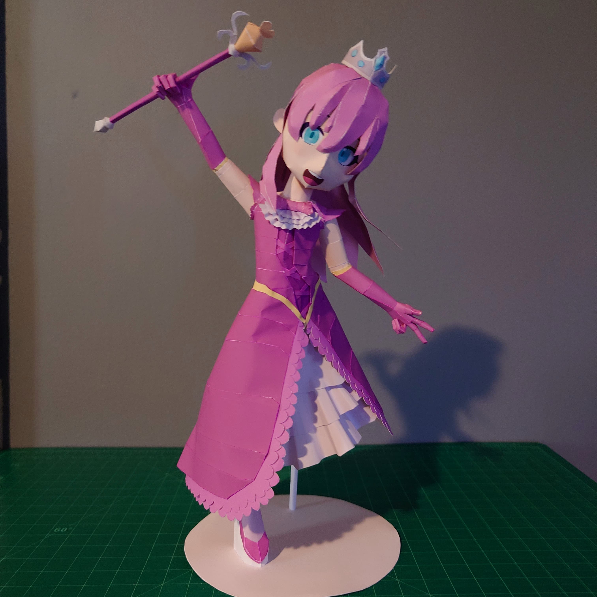
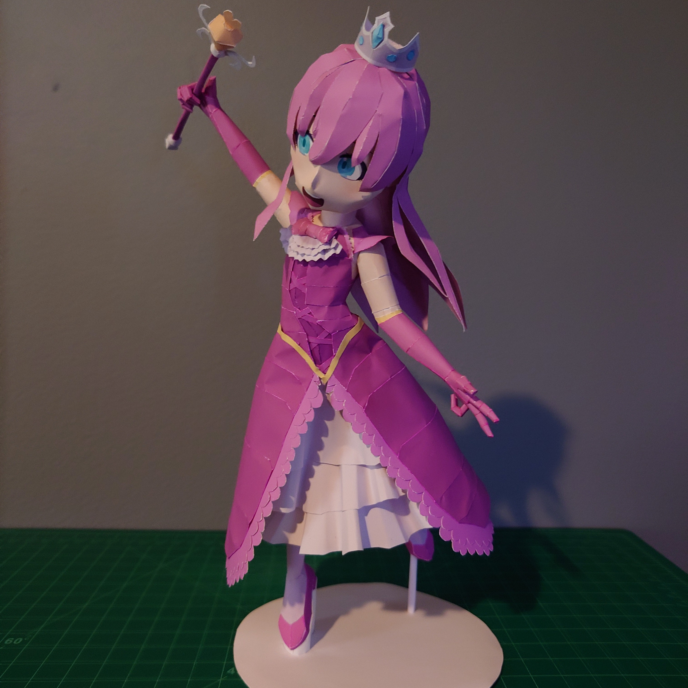
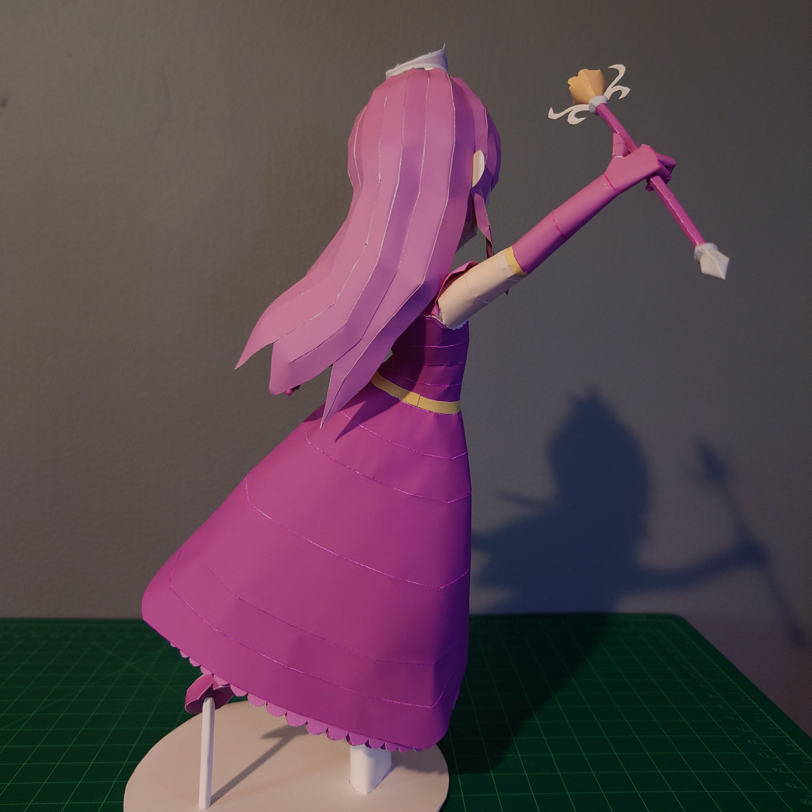

+++
date = '2024-10-31'
title = '🩷Princess Papercraft🩷'
image = 'princess-cover.jpg'
categories = ['Papercrafts']
tags = ['Terraria','Princess']
+++

My first public model! I based it off of the 1.4.1 update banner.

I would like to remake it some day. The scaling is a bit too large and I didn't include any instructions. Also, the stand is very basic. I also want to make the assembly easier for the remake.

## Pictures

    

## Model Details

- Series: Terraria
- Approx. Size: 17.9cm x 11.9cm x Height: 25cm
- 159 Parts
- 9 pages + 1 back

## Download

[Download (.pdo)](https://pepakura.tamasoft.co.jp/pepakura_designer/pepakura-gallery/dl.php?ext=pdo&id=2815&t=885078364.5)
