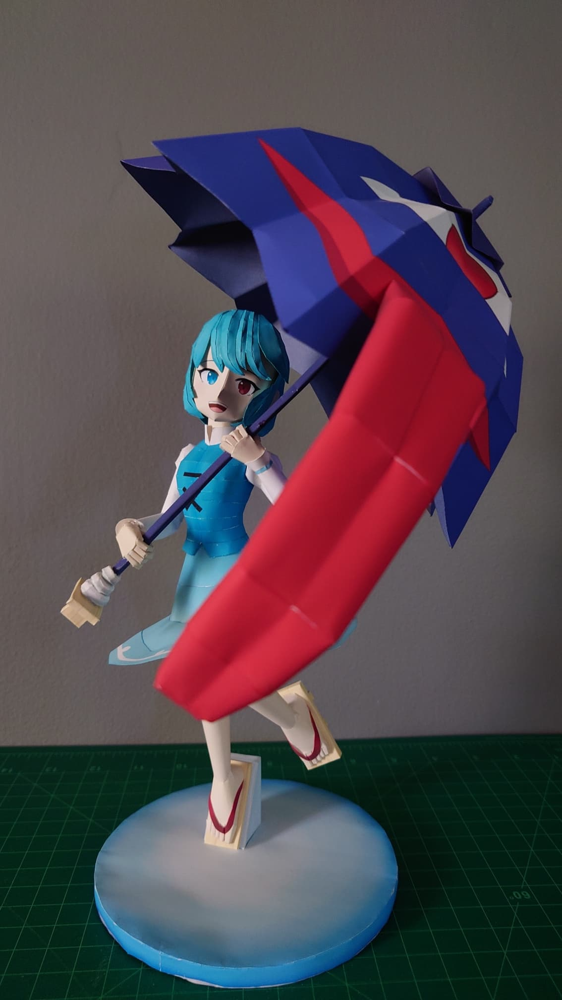
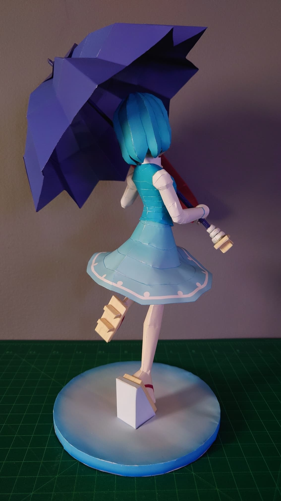

+++
date = '2025-01-17'
title = '☂️Kogasa Tatara Papercraft☂️'
image = 'kogasa-cover.jpg'
categories = ['Papercrafts']
tags = ['Touhou Project','Kogasa Tatara']
+++

Favorite 2hu Character

Assembly may seem complex but should be straight-forward. I used the same paper for both Kogasa and the umbrella, but I would recommend creating the umbrella with light paper, if possible.

## Pictures

  

## Model Details

- Series: Touhou Project
- Approx. Size: 20.4cm x 20.7cm x 30.6cm
- 150 Parts
- 12 pages + 4 back

## Download

[Download (.zip) (16.1 MB)](https://pepakura.tamasoft.co.jp/pepakura_designer/pepakura-gallery/dl.php?ext=zip&id=2822&t=885078433)
