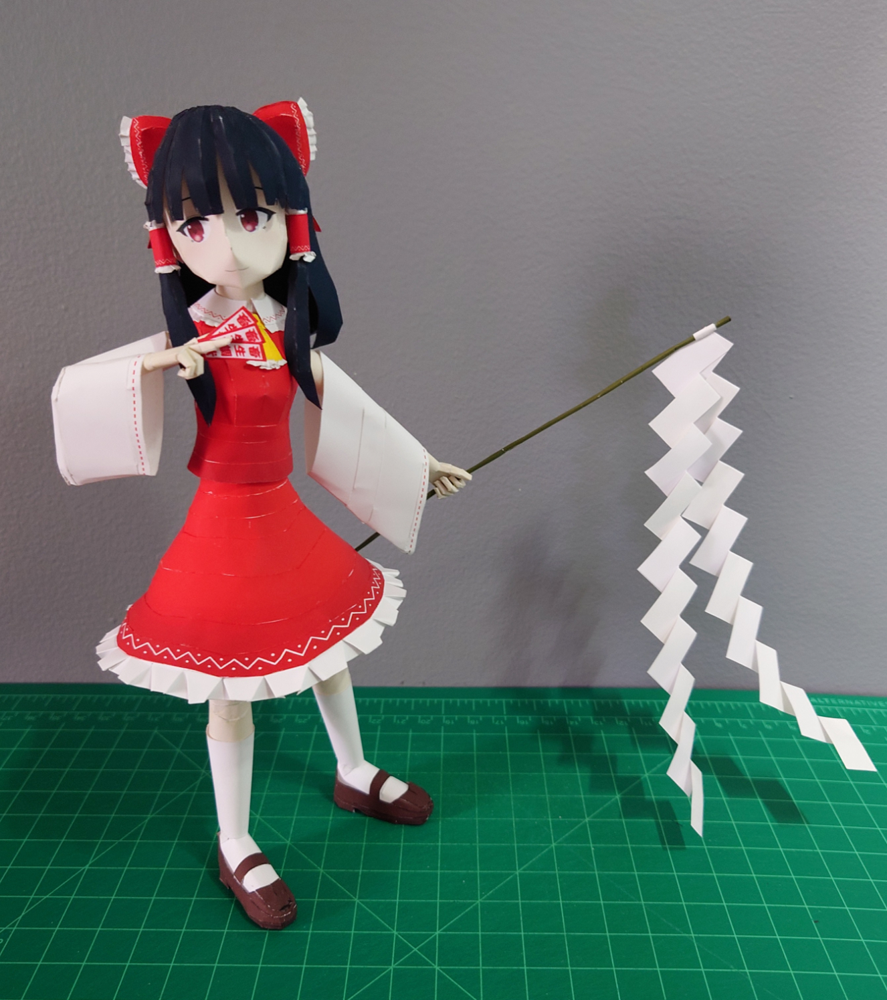

+++
date = '2025-04-05'
title = '⛩️Reimu Hakurei Papercraft⛩️'
image = 'reimu-cover.jpg'
categories = ['Papercrafts']
tags = ['Touhou Project','Reimu Hakurei']
+++

I included two different styles for the gohei, the folded one (as pictured,) and a flat one.

I also included the instructions on the pepakura file.

## Picture

## Model Details

- Series: Touhou Project
- Approx. Size: 20.8cm x 12.3cm x 24cm
- Approx. Size w/ Stand: 20.8cm x 12.3cm x 24.7cm
- 195 Parts
- 8 pages + 1 back

## Download

[Download (.pdo)](https://pepakura-designer.com/community/my_download_file.php?post_id=372&file_id=371)
