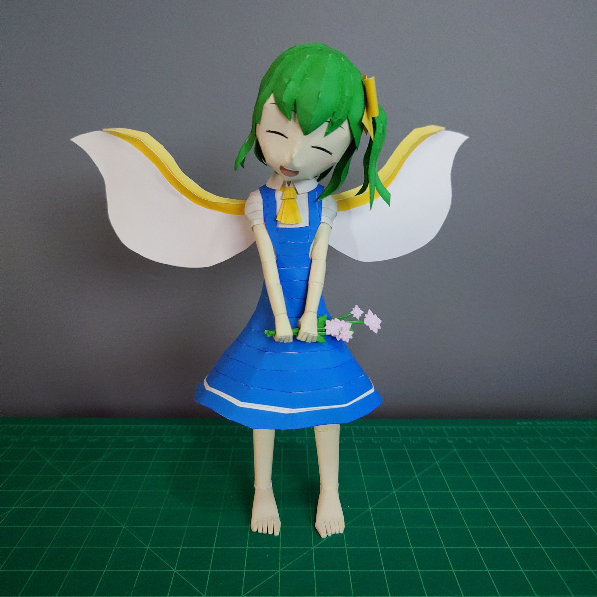
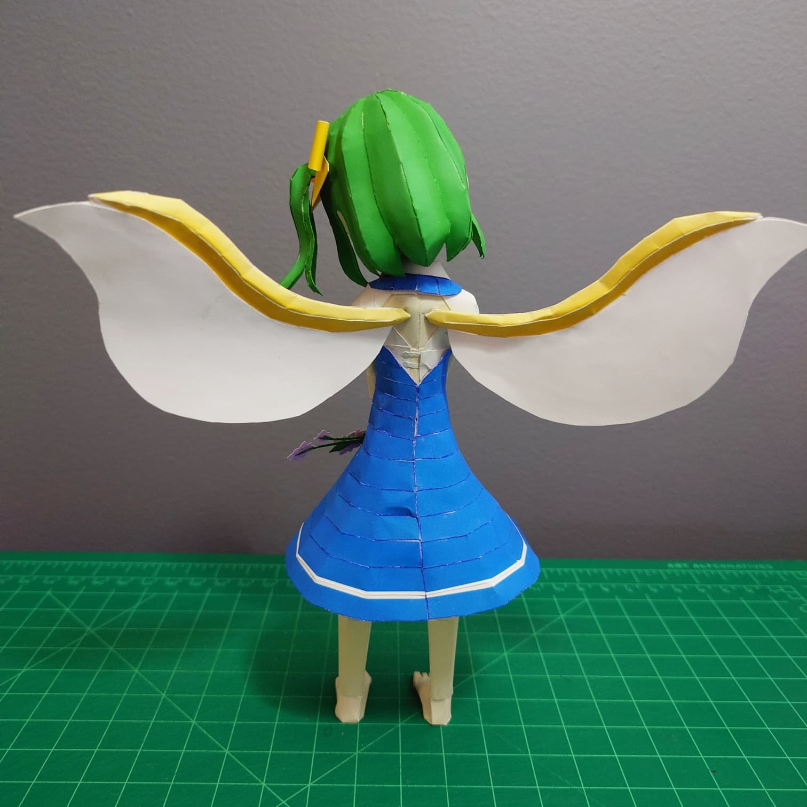

+++
date = '2025-09-14'
title = '🌼Daiyousei Papercraft🌼'
image = 'dai-cover.jpg'
categories = ['Papercrafts']
tags = ['Touhou Project','Daiyousei']
+++

Originally wanted to design her floating, but the completed model didn't turn out the way I wanted. So I used a standing pose instead.

I also wanted the clothes to make sense with her wings. I know it's an unnecessary detail, but it's something I wanted to do.

## Pictures

  

## Model Details

- Series: Touhou Project
- Approx. Size: 15.3cm x 8.7cm x 19.1cm
- Approx. Size w/ Stand: 15.3cm x 9.9cm x 19.7cm
- 169 Parts
- 6 pages + 1 back

## Download

[Download (.pdo)](https://pepakura-designer.com/community/my_download_file.php?post_id=527&file_id=526)
