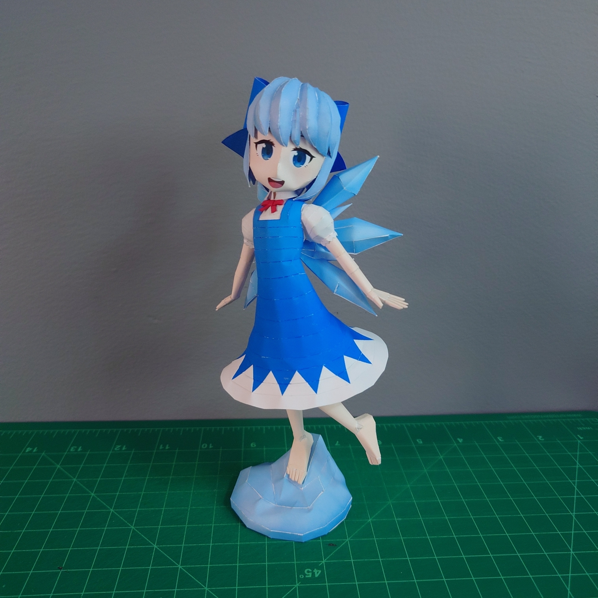
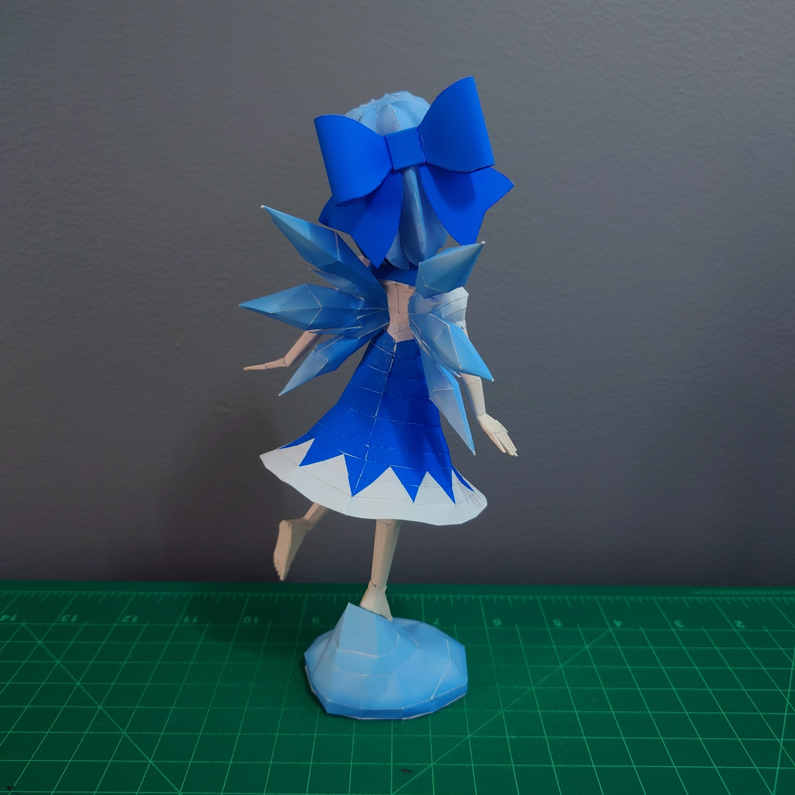

+++
date = '2025-11-13'
title = '❄️Cirno Papercraft❄️'
image = 'cirno-cover.jpg'
categories = ['Papercrafts']
tags = ['Touhou Project','Cirno']
+++

I used the same paper for the stand and for Cirno. I also didn't use any copper pellets to weigh down the model.

## Pictures

  

## Model Details

- Series: Touhou Project
- Approx. Size: 8.7cm x 8cm x 20.5cm
- 140 Parts
- 6 pages + 1 back

## Download

[Download (.pdo) (14.3 MB)](https://pepakura-designer.com/community/my_download_file.php?post_id=626&file_id=625)
