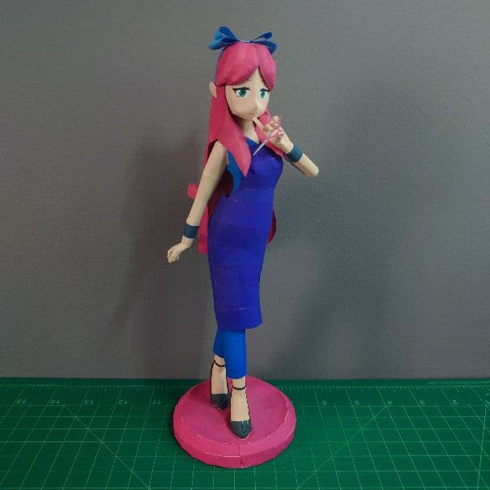
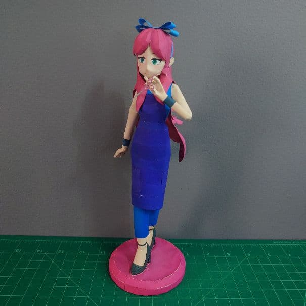
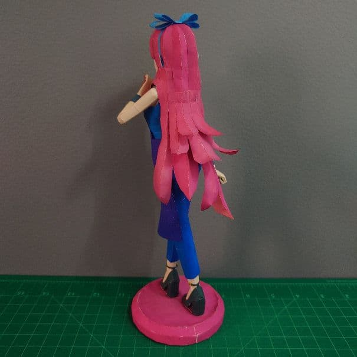
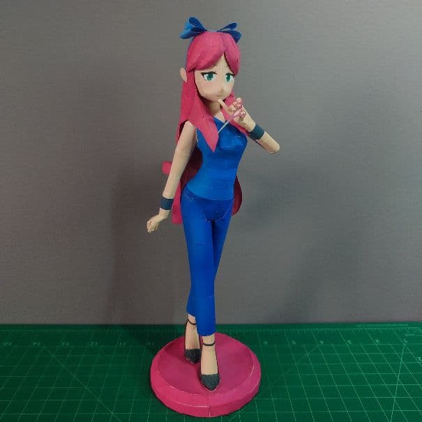
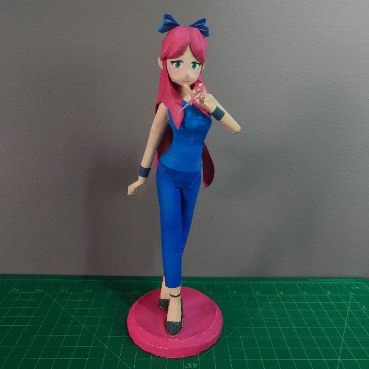
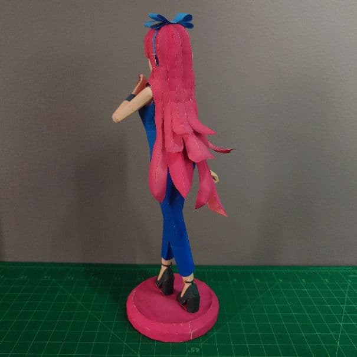
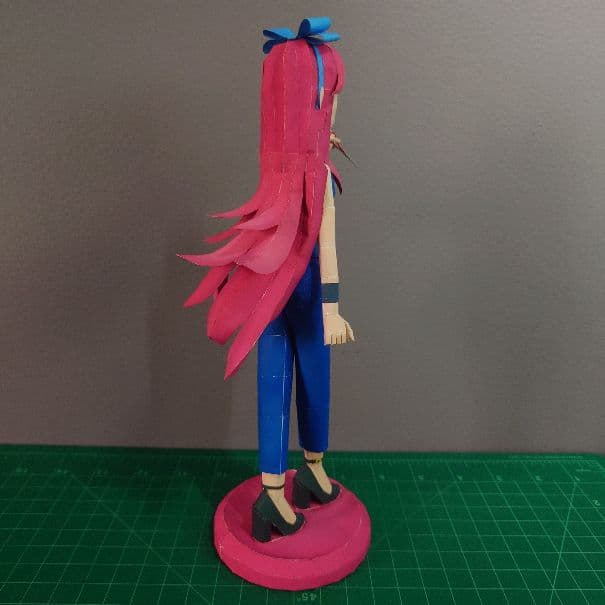

+++
date = '2026-02-21'
title = '✂️Stylist Papercraft✂️'
image = 'stylist-cover.jpg'
categories = ['Papercrafts']
tags = ['Terraria','Stylist']
+++

I used the same paper for everything. I also made the apron optional.

## Pictures

With Apron

        

Without Apron

       

## Model Details

- Series: Terraria
- Approx. Size: 8.9cm x 9.4cm x 25.3cm
- 149 Parts
- 6 pages + 2 back

## Download

[Download (.pdo) (10.9 MB)](https://pepakura-designer.com/community/my_download_file.php?post_id=796&file_id=795)
