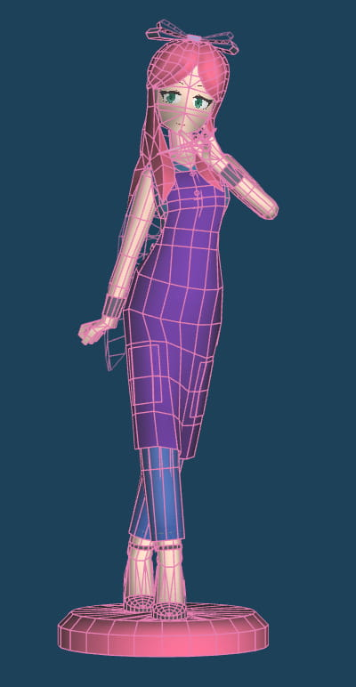
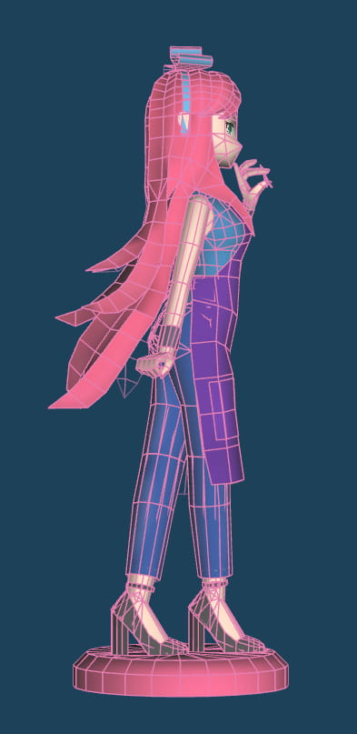
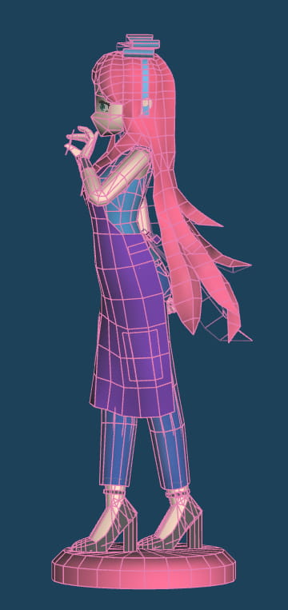
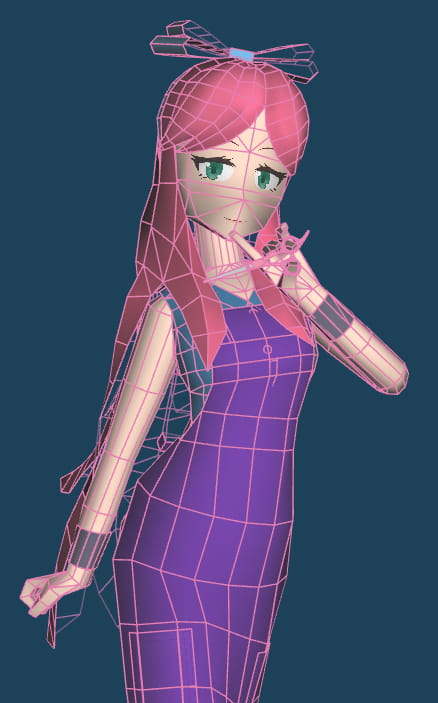
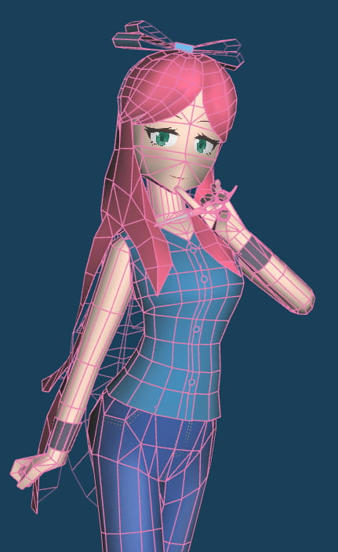
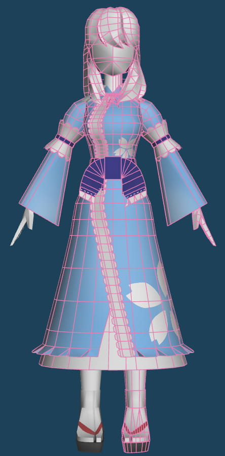

+++
date = '2026-02-03'
lastmod = '2026-02-05'
title = 'Papercraft Updates I'
categories = ['Updates']
tags = ['Terraria','Touhou Project','Stylist','Yuyuko Saigyouji','WIP']
+++

I'm currently working on two models:

## Stylist [Terraria]

      

  

The template for the Stylist is almost done, I'm still making small adjustments. Once I'm done with that, I can start the assembly.

## Yuyuko Saigyouji [Touhou Project]

I have most of the textures done. I tried different designs on the kimono, but decided on keep the design simple with cherry blossoms.

I also need to model the hat and remaining textures. From there, I can make the pose and template.

I can't say for sure when I'll have these models compeleted.
